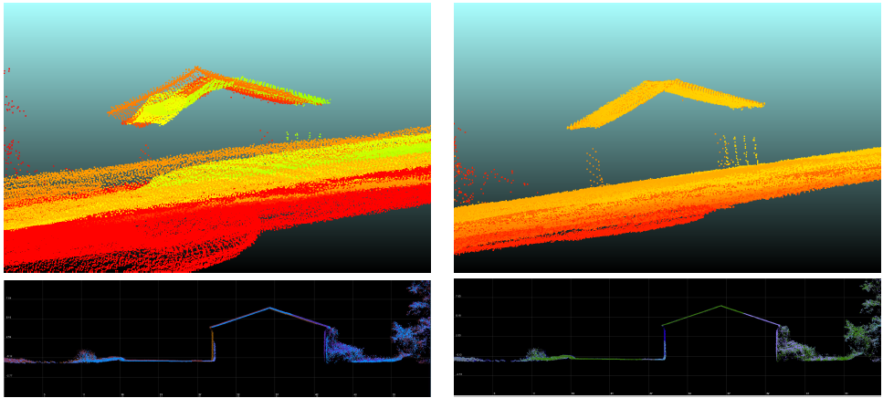

# Airborne LiDAR Strip Adjustment by Boresight Calibration

### Introduction

LiDAR (Light Detection and Ranging) systems are widely used in mobile and airborne mapping at various scales. Airborne surveys enable to map wide areas at high speed and relatively low resolution, while unmanned aerial vehicles (UAV) are used to get a detailed description of local areas. LiDAR systems are composed of a positioning system (GNSS receiver), an inertial measurement unit (IMU) and a LiDAR measuring relative distances to the terrain.

Georeferencing is performed by combining LiDAR angles and distance measurements, IMU attitude angles and GNSS positions with a point positioning mathematical model. This model depends on several parameters which are sources of systematic errors that can be observed by comparing overlapping survey strips [1].

### Problem

While a point cloud  may seem clear at high-scale, most of the time two or more structures appear in point clouds where there should only be one. This is a problem with the consistency of the point cloud due to the alignment of the LiDAR frame and the IMU frame. In the literature this problem has been addressed and it is called boresight calibration. See <b>Figure 1</b> for an example of boresight calibration. 

<b>Figure 1.</b> Boresight calibration of scans: before (left) and after (right).

### LiDAR System Georeferencing Model And Parameter Calibration
A typical LiDAR survey system consists of:

1. A positioning system giving the position of a positioning reference point (PRP), is denoted by  hereafter.

2. An IMU giving its orientation with respect to a local astronomic frame (LAF) (Let us mention that in practice, the IMU gives orientation in a local geodetic frame (LGF), as most IMU used in airborne surveying are not accurate enough to distinguish the LAF from the LGF. Therefore, we shall denote the LGF frame by (n) (navigation frame) to avoid confusion between geodetic and astronomical frames.). The IMU is composed by three accelerometers and three gyrometers, eventually hybridized with the GNSS system. It delivers the three attitude angles ,  and of the IMU with respect to the LGF.

3. A LiDAR, delivering relative distances from the LiDAR optical center (OC) to the ground. The LiDAR
output is generally given in Cartesian coordinates within the LiDAR frame.

#### The following frames will be used:

4. The LGF, that will be denoted by (n) and called the navigation frame (see Figure 3). The LGF frame can be for example a North-East-down (NED) frame, the N and E axis being tangent to the Ellipsoid at a chosen reference point.

5. The IMU body frame, denoted by (bI).

6 The LiDAR body frame, denoted by (bS).

### References
<b>[1]</b> Filin, S. Recovery of systematic biases in laser altimetry data using natural surfaces. Photogramm. Eng. Remote Sens.
2003, 69, 1235–1242.
