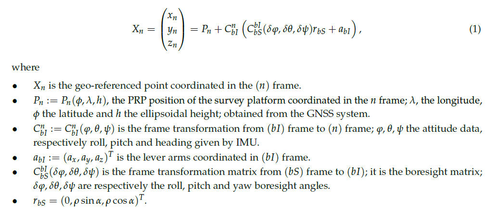

# Airborne LiDAR Strip Adjustment by Boresight Calibration

### Introduction

LiDAR (Light Detection and Ranging) systems are widely used in mobile and airborne mapping at various scales. Airborne surveys enable to map wide areas at high speed and relatively low resolution, while unmanned aerial vehicles (UAV) are used to get a detailed description of local areas. LiDAR systems are composed of a positioning system (GNSS receiver), an inertial measurement unit (IMU) and a LiDAR measuring relative distances to the terrain.

Georeferencing is performed by combining LiDAR angles and distance measurements, IMU attitude angles and GNSS positions with a point positioning mathematical model. This model depends on several parameters which are sources of systematic errors that can be observed by comparing overlapping survey strips [1].

### Problem

While a point cloud  may seem clear at high-scale, most of the time two or more structures appear in point clouds where there should only be one. This is a problem with the consistency of the point cloud due to the alignment of the LiDAR frame and the IMU frame. In the literature this problem has been addressed and it is called boresight calibration. See <b>Figure 1</b> for an example of boresight calibration. 

<b>Figure 1.</b> Boresight calibration of scans: before (left) and after (right).

### LiDAR System Georeferencing Model And Parameter Calibration

#### Variables Definition
A typical LiDAR survey system consists of:

1. A positioning system giving the position of a positioning reference point (PRP), is denoted by  hereafter.

2. An IMU giving its orientation with respect to a local astronomic frame (LAF) (Let us mention that in practice, the IMU gives orientation in a local geodetic frame (LGF), as most IMU used in airborne surveying are not accurate enough to distinguish the LAF from the LGF. Therefore, we shall denote the LGF frame by (n) (navigation frame) to avoid confusion between geodetic and astronomical frames.). The IMU is composed by three accelerometers and three gyrometers, eventually hybridized with the GNSS system. It delivers the three attitude angles ,  and of the IMU with respect to the LGF.

3. A LiDAR, delivering relative distances from the LiDAR optical center (OC) to the ground. The LiDAR output is generally given in Cartesian coordinates within the LiDAR frame.

The following frames will be used:

4. The LGF, that will be denoted by (n) and called the navigation frame (see Figure 3). The LGF frame can be for example a North-East-down (NED) frame, the N and E axis being tangent to the Ellipsoid at a chosen reference point.

5. The IMU body frame, denoted by (bI).

6 The LiDAR body frame, denoted by (bS).

#### Boresight Calibration

The objective of this paper is to design a calibration method for estimating the frame transformation from the (bS) frame to the (bI) frame, denoted by  (cosine type transformation) which depends on three boresight angles, denoted by  the boresight roll angle, , the boresight pitch angle and , the boresight yaw angle.

The data selection for the adjustment of boresight angles requires georeferenced points. Moreover,
the optimization model to estimate boresight angles incorporates the georeferencing process. For a given
LiDAR return, the georeferencing can be done as follows:

### Development

#### 1. Acquistion
#### [readQuanergyM8Lidar:](stripadjustment/readQuanergyM8Lidar.py)

- <b>Description</b>:  This module implement 3 classes and 1 method for reading Point Cloud information from Quanergy M8 Lidar.        
- <b>Input</b>:        File name with .lid extension. Parallel support.
- <b>Output</b>:       Pandas (Python) Dataframe with the following 10 fields: PacketTime(SoW),  Block, Azimuth, Channel, Return, Distance, Intensity, X, Y and Z.

#### [readIMUGPSQuanergyM8:](stripadjustment/readIMUGPSQuanergyM8.py)

- <b>Description</b>:  This module implement 1 class and 1 method for reading IMU and GPS information from Quanergy M8 Lidar.       
- <b>Input</b>:        File name with .out extension.
- <b>Output</b>:       Pandas (Python) Dataframe with the following 20 fields: GPSTime(SoW), Latitude, Longitude, Altitude, X, Y, Z, Roll, Pitch, Heading, VelX, VelY,  VelZ, AccX, AccY, AccZ, GyroX, GyroY, GyroZ and WanderAngle

##### Main Results: 
1. Loading 5 GB of LID (binary) data may take 20 min. On the contrary 8 GB of CSV (ASCII) data take 2 min to load.
2. Loading IMU/GPS data take 2 minute to load from OUT binary file. When loading from CSV it takes less than a minute.

#### 2. Timeline Matching: IMU/GPS - Lidar
In the following images you can observe the mismatch timeline problem when plotting lidar vs imu/gps synchronized timelines:

For this, we have matched IMU/GPS timestamps with Lidar timestamps when difference is below Lidar point cloud acquisition period and timestamps have not been matched before.

#### 3. Registration

The goal of point set registration is to assign correspondences between two sets of points and to recover the transformation that maps one point set to the other. A probabilistic method, called the <b>Coherent Point Drift (CPD)</b> [2] algorithm, for both rigid and non-rigid point set registration is implemented. We consider the alignment of two point sets as a probability density estimation problem. We fit the GMM centroids (representing the first point set) to the data (the second point set) by maximizing the likelihood. We force the GMM centroids to move coherently as a group to preserve the topological structure of the point sets. 
  
The CPD method is more robust than conventional iterative closest point (ICP) for registration.

#### [cpdRegistration:](stripadjustment/cpdRegistration.py)

- <b>Description</b>:  This module implement 1 method for registering two point clouds, 1 method for converting raw, pitch yaw to quaternion and 1 method for rotating points using quaternions (parallel support with pymp).
- <b>Output</b>:       Scale (real), Rotation (Matrix) and Translation (vector).

##### Main result:

Registration is very fast and robust to noise.

Rotation is been accelerated thanks to multicore implementation

### References
<b>[1]</b> Filin, S. Recovery of systematic biases in laser altimetry data using natural surfaces. Photogramm. Eng. Remote Sens.
2003, 69, 1235–1242.

<b>[2]</b> Andriy Myronenko and Xubo Song. Point Set registration: Coherent Point Drift (CPD).  IEEE Transactions on Pattern Analysis and Machine Intelligence. 2010. Volume: 32 , Issue: 12. https://arxiv.org/pdf/0905.2635.pdf
